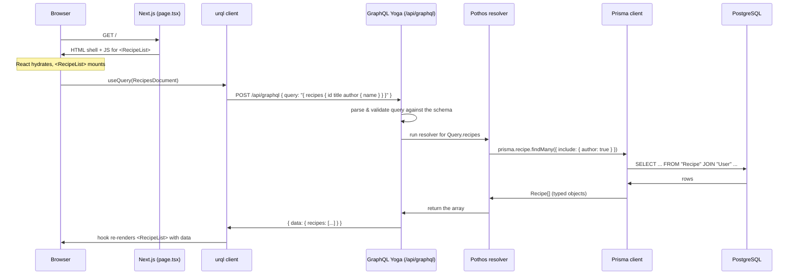

# Part 0 — Orientation

Before we install anything, this Part builds a map: what the finished app looks like, what each
tool in the stack does, how a GraphQL request actually travels through the system, and what you
need installed to follow along.

No code is written in Part 0. Read it once, then keep it open as a reference while you work
through the later Parts.

---

## 0.1 What we're building

We're building **Cookbook**, a small recipe sharing app. It's deliberately modest in features but
touches every layer of a real full-stack application: a database with related tables,
authentication, an API, server-rendered pages, and client-side interactivity.

### The features

- **Browse recipes** — anyone (logged in or not) can see a list of published recipes.
- **View a recipe** — a detail page showing the author, an ingredient list with quantities, and
  numbered steps.
- **Sign up and log in** — email + password, with the session stored in a secure cookie.
- **Publish a recipe** — logged-in users fill out a form: title, description, ingredients, steps,
  and tags.
- **Edit or delete** — but only recipes you own.
- **Favorite** — logged-in users can favorite other people's recipes and see them on a
  "My Favorites" page.
- **Search and filter** — by text, by tag, or by ingredient (Part 8).

### The screens

Rough wireframes of what we're heading toward. Don't worry about styling — the tutorial keeps CSS
minimal so the focus stays on data flow.

**Recipe list (`/`)**

```
┌──────────────────────────────────────────────────────────┐
│  Cookbook                         [ Search... ] [Log in] │
├──────────────────────────────────────────────────────────┤
│  Tags: ( All ) ( Dinner ) ( Vegan ) ( Quick ) ( Baking ) │
│                                                          │
│  ┌────────────────┐  ┌────────────────┐  ┌──────────────┐│
│  │ Weeknight Chili│  │ Lemon Tart     │  │ Miso Ramen   ││
│  │ by Sam · ♥ 12  │  │ by Alex · ♥ 30 │  │ by Sam · ♥ 8 ││
│  │ #dinner #quick │  │ #baking        │  │ #dinner      ││
│  └────────────────┘  └────────────────┘  └──────────────┘│
│                                                          │
│                    [ Load more ]                         │
└──────────────────────────────────────────────────────────┘
```

**Recipe detail (`/recipes/[id]`)**

```
┌──────────────────────────────────────────────────────────┐
│  ← Back                                                   │
│                                                          │
│  Weeknight Chili                              [ ♥ 12 ]    │
│  by Sam · updated 2 days ago          [ Edit ] [ Delete ] │
│  #dinner #quick                                           │
│                                                          │
│  A fast, one-pot chili for busy nights.                   │
│                                                          │
│  Ingredients                     Steps                    │
│  • 1 lb ground beef              1. Brown the beef...     │
│  • 1 onion, diced                2. Add onion and cook... │
│  • 2 cans kidney beans           3. Stir in tomatoes...   │
│  • 1 can crushed tomatoes        4. Simmer 20 minutes.    │
│  • 2 tbsp chili powder                                    │
└──────────────────────────────────────────────────────────┘
```

`[ Edit ]` and `[ Delete ]` only appear if you're logged in as the author. The `♥` button only
works when you're logged in.

**Create / edit recipe (`/recipes/new`, `/recipes/[id]/edit`)**

```
┌──────────────────────────────────────────────────────────┐
│  New recipe                                               │
│                                                          │
│  Title        [ Weeknight Chili                        ]  │
│  Description   [ A fast, one-pot chili...              ]  │
│                                                          │
│  Ingredients                                             │
│   [ 1     ] [ lb   ] [ ground beef        ]  [ Remove ]  │
│   [ 1     ] [      ] [ onion, diced       ]  [ Remove ]  │
│   [ + Add ingredient ]                                    │
│                                                          │
│  Steps                                                   │
│   1. [ Brown the beef in a large pot.     ]  [ Remove ]  │
│   2. [ Add onion and cook until soft.     ]  [ Remove ]  │
│   [ + Add step ]                                          │
│                                                          │
│  Tags   [ dinner ] [ quick ] [ + ]                        │
│                                                          │
│                              [ Cancel ]  [ Save recipe ]  │
└──────────────────────────────────────────────────────────┘
```

**Log in / sign up (`/login`, `/signup`)**

```
┌────────────────────────────────┐
│  Log in                        │
│                                │
│  Email     [                ]  │
│  Password  [                ]  │
│                                │
│           [ Log in ]           │
│                                │
│  No account? Sign up           │
└────────────────────────────────┘
```

**My Recipes / My Favorites (`/me/recipes`, `/me/favorites`)** — the same card grid as the
home page, filtered to the current user.

### Why a recipe app

Recipes have exactly the relationship shapes you need to learn:

- A recipe has **one** author (many-to-one).
- A recipe has **many** ordered steps (one-to-many).
- A recipe has **many** ingredients, *and each with its own quantity and unit* — that "extra data
  on the relationship" forces an explicit join table, which is a concept you'll hit constantly.
- A recipe has **many** tags and a tag has **many** recipes (many-to-many).
- A user **favorites** many recipes and a recipe is favorited by many users (another many-to-many,
  this one gated by authentication).

It's also easy to seed with data that's pleasant to look at while debugging.

---

## 0.2 The stack, piece by piece

Here's every tool, what it's responsible for, and where its job ends and the next tool's begins.

| Tool | Its job | Hands off to |
|---|---|---|
| **PostgreSQL** | Stores the data on disk. Enforces types, uniqueness, and foreign keys. Runs SQL. | Prisma |
| **Prisma** | Translates between SQL rows and TypeScript objects. Owns the schema definition and database migrations. Gives you a typed query client (`prisma.recipe.findMany(...)`). | Your resolvers |
| **Pothos** | A library for *defining* your GraphQL schema in TypeScript code. You describe types and fields; Pothos produces the schema object and keeps your resolver signatures type-checked. | GraphQL Yoga |
| **GraphQL Yoga** | The GraphQL *server*. Takes an HTTP request, parses the query, runs the right resolvers against the Pothos schema, and returns JSON. Also serves the GraphiQL explorer. | Next.js |
| **Next.js (App Router)** | The web framework. Serves pages (server- and client-rendered), does routing, and hosts the GraphQL server at `/api/graphql` via a *route handler*. | The browser |
| **urql** | The GraphQL *client*, running in the browser (and sometimes on the server). Sends queries to `/api/graphql`, caches results, and exposes React hooks (`useQuery`, `useMutation`). | Your React components |
| **GraphQL Code Generator** | A build-time tool. Reads the queries you write in your components and the schema from Pothos, and generates fully typed TypeScript for both. This is the glue that makes the whole thing type-safe end to end. | Your editor / `tsc` |
| **TypeScript** | The language everything is written in. The types generated by Prisma, Pothos, and Codegen mean a wrong field name is a red squiggle, not a runtime bug. | You |

The through-line: **one change to the Prisma schema ripples outward as type errors** until every
layer that touched that field is updated. That's the payoff you're building toward.

---

## 0.3 How GraphQL fits a Next.js app

You have two broad options for where the GraphQL server lives:

### Option A — A separate, standalone GraphQL server

A second application (its own process, its own deployment) that only does GraphQL. The Next.js app
calls it over the network.

- **Pro:** clean separation; multiple frontends or mobile apps can share it; scales independently.
- **Con:** two apps to run, deploy, and keep in sync; more infrastructure; CORS and auth get more
  involved.

This is common in larger organizations.

### Option B — A route handler inside the Next.js app  ← *what this tutorial does*

Next.js lets you define HTTP endpoints as files. `app/api/graphql/route.ts` exports `GET` and
`POST` functions, and Next.js serves them at `https://yoursite/api/graphql`. We mount GraphQL Yoga
there.

- **Pro:** one app, one `npm run dev`, one deployment. The GraphQL server and the code that calls
  it share types directly. Auth is just reading the same cookie.
- **Con:** the API isn't independently reusable or scalable — fine for a tutorial and for most
  small-to-medium apps.

```
your-app/
├── app/
│   ├── page.tsx                    ← the recipe list page (a React component)
│   ├── recipes/[id]/page.tsx       ← the recipe detail page
│   └── api/
│       └── graphql/
│           └── route.ts            ← the ENTIRE GraphQL server lives here
├── graphql/                        ← schema definitions (Pothos)
├── prisma/
│   └── schema.prisma               ← the database schema
└── lib/                            ← Prisma client, auth helpers, urql client
```

When you deploy this to Vercel, `/api/graphql` becomes a serverless function automatically. You
never think about it as a separate thing.

---

## 0.4 The request lifecycle

Follow a single interaction — **opening the recipe list page** — all the way down and back.



Things worth noticing:

1. **The query is a string the client sends.** GraphQL isn't magic transport — it's a POST request
   with a query in the body. You can watch it in the Network tab.
2. **The client asks for exact fields.** `{ recipes { id title } }` returns only those fields. Ask
   for `author { name }` and the resolver fetches the author too. No over- or under-fetching.
3. **Yoga validates before running anything.** A typo'd field name is rejected by the server with a
   clear error, before a single database query runs.
4. **Resolvers are just functions.** `Query.recipes` is a TypeScript function that returns data.
   Usually it calls Prisma, but it could call anything.
5. **Prisma turns one logical request into SQL.** The `include` becomes a JOIN (or a second
   query). You'll learn in Part 5 how the Pothos Prisma plugin keeps this efficient.
6. **The result flows back up unchanged in shape** — Postgres rows → Prisma objects → resolver
   return value → JSON → urql cache → React state.

For a **mutation** (like favoriting a recipe) the path is identical, except the resolver *writes*
to the database and the client updates its cache with the result.

---

## 0.5 Prerequisites and environment

You need four things installed. No prior TypeScript knowledge is assumed — Part 1 teaches it.

### 1. Node.js (LTS)

Use the current LTS release (Node 22 or newer). Check with:

```bash
node --version
```

If you don't have it, install via [nodejs.org](https://nodejs.org) or a version manager like
[`fnm`](https://github.com/Schniz/fnm) or [`nvm`](https://github.com/nvm-sh/nvm). A version
manager is worth it — different projects need different Node versions.

### 2. A package manager

This tutorial shows `npm` commands (it ships with Node, so it's the safe default). If you prefer
`pnpm` or `yarn`, the commands translate directly:

| npm | pnpm | yarn |
|---|---|---|
| `npm install` | `pnpm install` | `yarn` |
| `npm install foo` | `pnpm add foo` | `yarn add foo` |
| `npm run dev` | `pnpm dev` | `yarn dev` |
| `npx prisma ...` | `pnpm dlx prisma ...` | `yarn dlx prisma ...` |

### 3. Docker Desktop

We run PostgreSQL in a container so you don't have to install and manage a database server
directly. Install [Docker Desktop](https://www.docker.com/products/docker-desktop/) and make sure
it's running:

```bash
docker --version
docker compose version
```

If you already have a local PostgreSQL you're comfortable with, you can skip Docker and just point
`DATABASE_URL` at it — but the tutorial assumes the Docker setup from Part 3.

### 4. An editor with TypeScript support

**VS Code** is the path of least resistance — its TypeScript integration is built in. Install
these extensions:

- **Prisma** (`Prisma.prisma`) — syntax highlighting and formatting for `schema.prisma`.
- **GraphQL: Language Feature Support** (`GraphQL.vscode-graphql`) — autocomplete and validation
  inside GraphQL query strings.
- **ESLint** (`dbaeumer.vscode-eslint`) — surfaces lint errors inline.

Other editors (JetBrains WebStorm, Neovim with the right LSPs) work fine too; you just configure
the equivalents.

### Sanity check

Before moving on, all four of these should print a version without error:

```bash
node --version        # v22.x or newer
npm --version
docker --version
docker compose version
```

---

## What's next

**Part 1 — TypeScript from the ground up.** Everything after this is written in TypeScript, and
the types are what make the stack hang together. We start from `string` and `number` and build up
to the generics that Prisma, Pothos, and urql all rely on.

If you're already fluent in TypeScript, skim Part 1 for §1.7 (generics) and §1.8 (utility types),
then jump to **Part 2 — A React refresher**.
