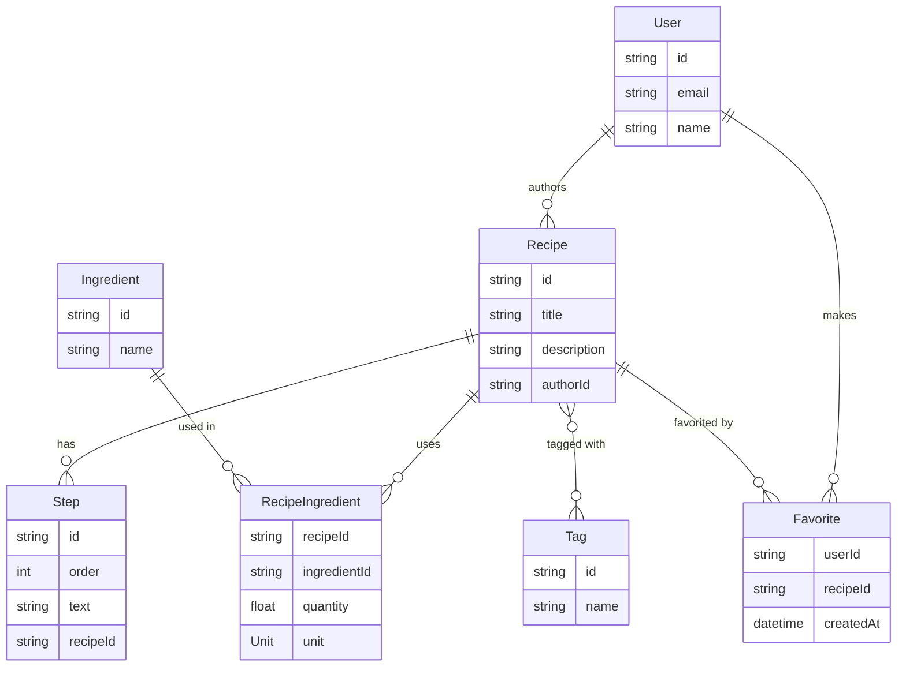

# Part 4 — Modeling the data

Part 3 gave you an empty, connected database. This Part designs the actual schema — the tables
Cookbook is built on — writes it as a Prisma schema, migrates the database to match, and seeds it
with enough realistic data that Part 5's resolvers have something to query against.

No frontend, no GraphQL yet. This is purely: design the shape of the data, then get Postgres to
hold it.

> **Follow along.** Continues from `part-03-complete` — Docker Postgres up, Prisma installed, an
> empty `schema.prisma`. Run `docker compose up -d` if the container isn't already running. The
> repo is committed and tagged `part-04-complete` at the end.

---

## 4.1 The domain model

Cookbook needs seven things to exist as data:

- **User** — someone who can sign up, publish recipes, and favorite others'.
- **Recipe** — a title, a description, an author, and the things below it.
- **Step** — one instruction in a recipe, in order.
- **Ingredient** — a reusable thing like "onion" or "chili powder" — shared across every recipe
  that uses it, not duplicated per recipe.
- **RecipeIngredient** — the join between a `Recipe` and an `Ingredient`, carrying the *quantity*
  and *unit* that are specific to that recipe (2 tbsp of chili powder in this recipe, not "2 tbsp"
  as a property of chili powder itself).
- **Tag** — a label like `dinner` or `vegan`, shared across recipes the same way an `Ingredient`
  is.
- **Favorite** — the join between a `User` and the `Recipe`s they've favorited.

Two of those — `RecipeIngredient` and `Favorite` — are joins, but they're modeled differently, and
that difference is worth understanding before writing any schema:

- **`Recipe` ↔ `Ingredient` needs an explicit join model** because the relationship itself carries
  data — quantity and unit belong to "chili powder in this recipe," not to chili powder, and not
  to the recipe. A plain many-to-many can't hold that; a third model with foreign keys to both
  sides can.
- **`Recipe` ↔ `Tag` doesn't** — a tag is just present or absent on a recipe, nothing more. Prisma
  can manage that join table for you invisibly. (`Favorite` *could* have been implicit too, but
  it'll want a `createdAt` — "favorited on" — in Part 7, so it's explicit from the start rather
  than migrated later.)

Here's the shape:



Everything hangs off `Recipe`. `User` and `Ingredient`/`Tag` are the two "shared, referenced from
many places" entities — a `User` authors many `Recipe`s, an `Ingredient` is used in many
`RecipeIngredient` rows across different recipes.

---

## 4.2 Writing the Prisma schema

Open `prisma/schema.prisma` — it currently has just the `generator` and `datasource` blocks from
Part 3. Append the models below them.

### Scalar fields, `@id`, `@default`, `@updatedAt`

Start with `User`:

```prisma
model User {
  id        String   @id @default(cuid())
  email     String   @unique
  name      String
  createdAt DateTime @default(now())
}
```

- **`@id`** — the primary key.
- **`@default(cuid())`** — Prisma generates a collision-resistant string ID at insert time, rather
  than you supplying one or the database auto-incrementing an integer. Fine for every model here;
  string IDs also mean you never leak a sequential row count ("user #4") to a client.
- **`@unique`** — a unique constraint at the database level, not just an application check.
  `email` has to be unique for login to make sense later.
- **`@default(now())`** — set once, at creation.

`Recipe` adds `@updatedAt`:

```prisma
model Recipe {
  id          String   @id @default(cuid())
  title       String
  description String?
  createdAt   DateTime @default(now())
  updatedAt   DateTime @updatedAt

  authorId    String
  author      User     @relation(fields: [authorId], references: [id], onDelete: Cascade)
}
```

- **`description String?`** — the `?` makes it nullable. Not every recipe needs a description.
- **`@updatedAt`** — Prisma sets this automatically on every `update`, no application code needed.
- **`onDelete: Cascade`** — deleting a `User` deletes their recipes too. A real product might
  soften this (reassign to a "deleted user" placeholder, or block the delete outright), but
  cascading keeps the tutorial's data model honest without extra machinery. We're calling the
  tradeoff out here rather than making it silently.

### How a relation actually works: `@relation`, `fields`, `references`

`authorId` and `author` deserve a slower look, because every relation in this schema — one-to-many
*and* both many-to-many shapes — is this exact same pair, repeated:

```prisma
authorId String
author   User     @relation(fields: [authorId], references: [id])
```

Two fields, doing two different jobs:

- **`authorId String`** — a real column in the `Recipe` table. This is the actual foreign key; if
  you ran `\d "Recipe"` in `psql` (§4.5) right now, you'd see `authorId` sitting there next to
  `title` and `description`, typed `text`. There's nothing Prisma-specific about it — it's exactly
  what you'd write by hand in plain SQL.
- **`author User`** — *not* a column. Prisma calls this a **relation field**. It exists only in
  the generated TypeScript client, as the thing that lets you write `recipe.author.name` instead
  of hand-writing a join. It's typed as `User` because that's what Prisma resolves it to when you
  ask for it — under the hood, that's a second query (or a SQL join) keyed off `authorId`, run for
  you.

`@relation(fields: [authorId], references: [id])` is the line that connects those two fields to
each other, and it reads almost like plain English: *this relation field (`author`) is backed by
the local field(s) listed in `fields`* — `authorId`, a column on `Recipe`, the model you're
standing in — *which point at the field(s) listed in `references`* — `id`, a column on `User`, the
*other* model. `fields` is always local; `references` is always on the far side, and is almost
always that model's `@id`. This isn't a Prisma-only abstraction — run the migration and it becomes
a literal `FOREIGN KEY ("authorId") REFERENCES "User"("id")` constraint in Postgres. `@relation` is
telling Prisma what SQL to generate, not inventing a new concept on top of SQL.

One more thing worth internalizing now, because it explains everything relation-shaped for the
rest of this Part: **Prisma only has one real relation mechanic** — one side holds a foreign key
and a `@relation(fields:, references:)`, the other side doesn't. Everything you'll see called
"one-to-many" or "many-to-many" is that single mechanic, arranged differently:

- **One-to-many, from the "one" side** — `User` will get `recipes Recipe[]` (added once `Step`'s
  pattern below is familiar). No `@relation`, no foreign key — it's a pure computed backreference
  so you can write `user.recipes`, generated by Prisma from the *other* side's `@relation` alone.
  A relation is declared once, on the side that holds the key; the far side's array field is just
  the reverse view of it.
- **Many-to-many with an explicit join** (`RecipeIngredient`, `Favorite`, further down) — is that
  *same* one-to-many mechanic, used **twice** in one model. `RecipeIngredient` holds a foreign key
  to `Recipe` *and, separately,* a foreign key to `Ingredient`. There's no dedicated many-to-many
  syntax — it's two ordinary one-to-many relations meeting in the middle. When you get there, it
  will look like more machinery than `Recipe.author`, but it's the identical `fields`/`references`
  pattern, written twice.
- **Many-to-many, implicit** (`Tag`, also further down) is the one case with no `@relation` at all
  on *either* side — because neither side is willing to hold the other's foreign key (a recipe
  doesn't "belong to" one tag, nor a tag to one recipe), Prisma generates and manages a hidden join
  table for you instead of asking you to write one.

### One-to-many: `Recipe` → `Step`

```prisma
model Step {
  id       String @id @default(cuid())
  order    Int
  text     String

  recipeId String
  recipe   Recipe @relation(fields: [recipeId], references: [id], onDelete: Cascade)

  @@unique([recipeId, order])
}
```

Same `recipeId`/`recipe` pair as above — that's the whole pattern for one-to-many, the "many" side
just holds the foreign key. `@@unique([recipeId, order])` is a **composite unique constraint**: no
two steps in the *same* recipe can share a step number, but step `1` can obviously exist in every
recipe. `@@` (double-at) constraints apply to a combination of fields rather than one field alone.

Back on `Recipe`, add the other side of the relation so you can navigate `recipe.steps`:

```prisma
model Recipe {
  // ...fields from above...
  steps Step[]
}
```

### Many-to-many with an explicit join: `Recipe` ↔ `Ingredient`

```prisma
model Ingredient {
  id      String             @id @default(cuid())
  name    String             @unique
  recipes RecipeIngredient[]
}

model RecipeIngredient {
  quantity Float
  unit     Unit

  recipeId     String
  recipe       Recipe     @relation(fields: [recipeId], references: [id], onDelete: Cascade)
  ingredientId String
  ingredient   Ingredient @relation(fields: [ingredientId], references: [id])

  @@id([recipeId, ingredientId])
}
```

- **`recipeId`/`recipe` and `ingredientId`/`ingredient`** — this is the pattern from the previous
  section, just written twice in one model: `RecipeIngredient` is a many-to-one to `Recipe` (many
  ingredient rows per recipe) *and, independently,* a many-to-one to `Ingredient` (that same
  ingredient can show up in many recipes' rows). Nothing new here — two ordinary
  `@relation(fields:, references:)` pairs is the entire mechanism behind "many-to-many with an
  explicit join."
- **`@@id([recipeId, ingredientId])`** — a **composite primary key** instead of its own `id`
  field. "Ground beef in this recipe" is uniquely identified by *which recipe* and *which
  ingredient*, so there's nothing a separate surrogate ID would add — and it enforces, for free,
  that an ingredient can only appear once per recipe (add a second row for the same pair and the
  insert fails).
- **`unit Unit`** — a field typed as an enum, defined next.

And the enum:

```prisma
enum Unit {
  GRAM
  KILOGRAM
  MILLILITER
  LITER
  TEASPOON
  TABLESPOON
  CUP
  PIECE
}
```

Prisma generates a matching TypeScript union type — `Unit` becomes `"GRAM" | "KILOGRAM" | ...` in
`@prisma/client`, so `RecipeIngredient.unit` is exactly as type-safe as everything else, and an
invalid unit is a compile error, not a runtime surprise.

### Many-to-many, implicit: `Recipe` ↔ `Tag`

```prisma
model Tag {
  id      String   @id @default(cuid())
  name    String   @unique
  recipes Recipe[]
}
```

And on `Recipe`:

```prisma
model Recipe {
  // ...
  tags Tag[]
}
```

That's the entire schema for it — `Recipe[]` on `Tag` and `Tag[]` on `Recipe`, no join model,
no foreign keys written by hand. Prisma creates and manages a join table (`_RecipeToTag`) behind
the scenes; you never query it directly, only `recipe.tags` / `tag.recipes`. This is the right
call *specifically because* the relationship carries no data of its own — the moment you need to
attach something to "this tag on this recipe" (an order, a note, anything), it has to become
explicit, the way `Favorite` and `RecipeIngredient` are.

### The last join: `User` ↔ `Recipe` via `Favorite`

```prisma
model Favorite {
  userId    String
  user      User     @relation(fields: [userId], references: [id], onDelete: Cascade)
  recipeId  String
  recipe    Recipe   @relation(fields: [recipeId], references: [id], onDelete: Cascade)
  createdAt DateTime @default(now())

  @@id([userId, recipeId])
}
```

Structurally identical to `RecipeIngredient` — composite `@@id`, two foreign keys, one extra
column (`createdAt`) that's the entire reason this is explicit instead of an implicit `Recipe[]`
on `User`.

Finish wiring up the back-references so every relation is navigable from both sides — `User` gets
`recipes Recipe[]` and `favorites Favorite[]`, `Recipe` gets `favoritedBy Favorite[]` and
`ingredients RecipeIngredient[]`. The full schema, assembled, is in the checkpoint below if you
want to check your version against it.

### Indexes

Postgres doesn't automatically index a foreign-key column the way some databases do. Every
relation above gets queried by its foreign key constantly (`WHERE "authorId" = ...`, `WHERE
"recipeId" = ...`), so add explicit indexes:

```prisma
model Recipe {
  // ...
  @@index([authorId])
}
```

Add `@@index([recipeId])` to `Step`, and Prisma already indexes `@@id`/`@@unique` composites for
you, which covers the lookup patterns on `RecipeIngredient` and `Favorite`.

---

## 4.3 Migrations

With the schema written, turn it into an actual set of database tables:

```bash
npx prisma migrate dev --name init
```

Read what this does, in order:

1. Diffs your schema against the database's current state (empty, so far) and generates SQL.
2. Writes that SQL into a new folder: `prisma/migrations/<timestamp>_init/migration.sql`.
3. Applies it to your local database.
4. Regenerates `@prisma/client` so the new models' types exist.

Open the generated `migration.sql` and read it — it's plain `CREATE TABLE` / `CREATE INDEX`
statements, nothing magic. This file is what actually ships; `schema.prisma` is the source you
edit, migrations are the generated, committed history of how the database got from empty to this
shape.

**Every schema change from here on gets its own migration.** Add a field next month, run `migrate
dev --name add-recipe-image` again — it diffs against the *new* current state and generates just
the delta. The `prisma/migrations/` folder is an append-only log; never hand-edit an already-
applied migration file. If you need to walk back a change entirely, add a new migration that
reverses it, the same way you'd revert with a new commit rather than rewriting history.

### `migrate dev` vs `migrate reset` vs `db push`

- **`migrate dev`** — what you just ran. Generates and applies a migration file. This is what
  you use for every real schema change, because it leaves a record.
- **`migrate reset`** — drops the database, reapplies every migration from scratch, then reruns
  the seed script (§4.4). Reach for it when your local database drifts from what the migrations
  describe, or you just want a clean slate — never on anything but a local dev database.
- **`db push`** — syncs the schema straight to the database with no migration file at all. It's
  for fast prototyping *before* you've committed to a shape; once you're generating real
  migrations, mixing in `db push` desyncs the two. We don't use it in this tutorial past this
  paragraph.

---

## 4.4 Seeding

An empty, correctly-shaped database isn't enough to build against — Part 5's resolvers need rows
to return. Add a seed script.

First, a runner for the TypeScript file — Prisma's classic seed setup shells out to whatever
command you configure, and needs one that can execute `.ts` directly:

```bash
npm install -D tsx
```

Then tell Prisma how to run the seed, in `package.json`:

```jsonc
{
  // ...
  "prisma": {
    "seed": "tsx prisma/seed.ts"
  }
}
```

Create `prisma/seed.ts`:

```ts
import { PrismaClient, Unit } from "@prisma/client";

const prisma = new PrismaClient();

async function main() {
  // Wipe in dependency order — children before parents — so re-running this script
  // is always safe.
  await prisma.favorite.deleteMany();
  await prisma.recipeIngredient.deleteMany();
  await prisma.step.deleteMany();
  await prisma.recipe.deleteMany();
  await prisma.tag.deleteMany();
  await prisma.ingredient.deleteMany();
  await prisma.user.deleteMany();

  const sam = await prisma.user.create({ data: { email: "sam@example.com", name: "Sam" } });
  const alex = await prisma.user.create({ data: { email: "alex@example.com", name: "Alex" } });

  const [beef, onion, chiliPowder, beans] = await Promise.all([
    prisma.ingredient.create({ data: { name: "Ground beef" } }),
    prisma.ingredient.create({ data: { name: "Onion" } }),
    prisma.ingredient.create({ data: { name: "Chili powder" } }),
    prisma.ingredient.create({ data: { name: "Kidney beans" } }),
  ]);

  const [dinner, quick] = await Promise.all([
    prisma.tag.create({ data: { name: "dinner" } }),
    prisma.tag.create({ data: { name: "quick" } }),
  ]);

  const chili = await prisma.recipe.create({
    data: {
      title: "Weeknight Chili",
      description: "A fast, no-fuss chili for a weeknight.",
      authorId: sam.id,
      tags: { connect: [{ id: dinner.id }, { id: quick.id }] },
      steps: {
        create: [
          { order: 1, text: "Brown the beef with the diced onion." },
          { order: 2, text: "Stir in the chili powder and beans." },
          { order: 3, text: "Simmer for 20 minutes." },
        ],
      },
      ingredients: {
        create: [
          { ingredientId: beef.id, quantity: 500, unit: Unit.GRAM },
          { ingredientId: onion.id, quantity: 1, unit: Unit.PIECE },
          { ingredientId: chiliPowder.id, quantity: 2, unit: Unit.TABLESPOON },
          { ingredientId: beans.id, quantity: 400, unit: Unit.GRAM },
        ],
      },
    },
  });

  await prisma.favorite.create({ data: { userId: alex.id, recipeId: chili.id } });

  console.log("Seeded.");
}

main()
  .catch((error) => {
    console.error(error);
    process.exitCode = 1;
  })
  .finally(() => prisma.$disconnect());
```

Worth noticing: `tags: { connect: [...] }` and `steps: { create: [...] }` inside one
`prisma.recipe.create` call is a **nested write** — Prisma creates the recipe, the steps, and the
join rows in a single call (a single transaction), rather than you manually sequencing four
separate queries and wiring the foreign keys yourself. This is the same nested-write shape Part 5
uses for the `createRecipe` mutation.

Run it:

```bash
npx prisma db seed
```

(`migrate reset`, mentioned above, runs this automatically after reapplying migrations — so once
this is wired up you rarely call `db seed` directly except right after writing it, like now.)

---

## 4.5 Inspecting your data

### Prisma Studio

```bash
npx prisma studio
```

Opens `http://localhost:5555` — a browser GUI over your actual tables. Click into `Recipe` and you
should see "Weeknight Chili" with Sam as the author; click into `RecipeIngredient` and you'll see
the four join rows with their quantities and units. It's the fastest way to eyeball whether a
migration or a seed did what you expected, and you'll reach for it constantly through Part 5 and
6 to check that a mutation actually wrote what you think it wrote.

### A `psql` primer

Studio is a GUI over the data; sometimes you want the actual SQL. Get a `psql` shell inside the
running container:

```bash
docker compose exec db psql -U cookbook -d cookbook
```

A handful of commands to get oriented:

```sql
\dt                          -- list tables
\d "Recipe"                  -- describe a table's columns, types, and constraints
SELECT * FROM "Recipe";      -- table and column names are double-quoted — Prisma
                              -- preserves the exact PascalCase names from the schema,
                              -- and Postgres folds unquoted identifiers to lowercase
SELECT "title", "authorId" FROM "Recipe";
\q                            -- quit
```

That quoting detail matters the first time you write raw SQL against a Prisma-managed database:
`SELECT * FROM Recipe` (unquoted) fails, because Postgres looks for a table literally named
`recipe`, not `Recipe`.

---

## Checkpoint — a fully migrated schema and a seeded database

The complete `prisma/schema.prisma`, models only (generator/datasource are unchanged from Part 3):

```prisma
model User {
  id        String     @id @default(cuid())
  email     String     @unique
  name      String
  createdAt DateTime   @default(now())

  recipes   Recipe[]
  favorites Favorite[]
}

model Recipe {
  id          String   @id @default(cuid())
  title       String
  description String?
  createdAt   DateTime @default(now())
  updatedAt   DateTime @updatedAt

  authorId    String
  author      User     @relation(fields: [authorId], references: [id], onDelete: Cascade)

  steps       Step[]
  ingredients RecipeIngredient[]
  tags        Tag[]
  favoritedBy Favorite[]

  @@index([authorId])
}

model Step {
  id       String @id @default(cuid())
  order    Int
  text     String

  recipeId String
  recipe   Recipe @relation(fields: [recipeId], references: [id], onDelete: Cascade)

  @@unique([recipeId, order])
  @@index([recipeId])
}

model Ingredient {
  id      String             @id @default(cuid())
  name    String             @unique
  recipes RecipeIngredient[]
}

model RecipeIngredient {
  quantity Float
  unit     Unit

  recipeId     String
  recipe       Recipe     @relation(fields: [recipeId], references: [id], onDelete: Cascade)
  ingredientId String
  ingredient   Ingredient @relation(fields: [ingredientId], references: [id])

  @@id([recipeId, ingredientId])
}

enum Unit {
  GRAM
  KILOGRAM
  MILLILITER
  LITER
  TEASPOON
  TABLESPOON
  CUP
  PIECE
}

model Tag {
  id      String   @id @default(cuid())
  name    String   @unique
  recipes Recipe[]
}

model Favorite {
  userId    String
  user      User     @relation(fields: [userId], references: [id], onDelete: Cascade)
  recipeId  String
  recipe    Recipe   @relation(fields: [recipeId], references: [id], onDelete: Cascade)
  createdAt DateTime @default(now())

  @@id([userId, recipeId])
}
```

You should be able to run all of this cleanly:

```bash
# 1. Migration applies cleanly
npx prisma migrate dev --name init

# 2. Seed runs without error
npx prisma db seed

# 3. Studio opens and shows the seeded rows
npx prisma studio

# 4. The whole reset cycle works end to end — this is the one you'll
#    reach for constantly once Part 5 starts changing the schema
npx prisma migrate reset
```

**What you have now:**

- A complete Prisma schema covering every relation shape you'll need for the rest of the tutorial:
  one-to-many, many-to-many (implicit and explicit-with-data), composite keys, an enum, and
  indexes.
- A migration history in `prisma/migrations/` that reproduces the schema from empty.
- A seed script that gives you real rows to develop against, safely re-runnable.
- A working `prisma studio` and a `psql` escape hatch for whenever the GUI isn't enough.

Commit and tag:

```bash
git add -A
git commit -m "Part 4 — data modeling: schema, migrations, seed"
git tag part-04-complete
```

---

## What's next

Part 5 puts a GraphQL API in front of this schema — a Pothos schema builder wired to Prisma,
`Query.recipes`/`Query.recipe`, and the mutations that write through the nested-write pattern
`seed.ts` just used by hand.
